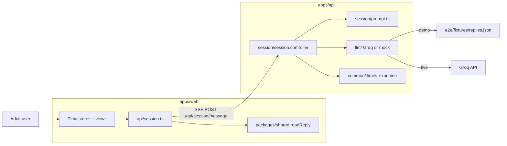

# Architecture — decision-clarity text app

Updated 2026-09-22. The [implementation plan](implementation-plan.md) tracks delivery and release gates. Canonical behavior and crisis wording live in [system prompt](prompt/system-prompt.md) and [decision.log](../decision.log).

## Product boundary

An adult, session-only **decision-clarity text** flow. No accounts, no transcript database, no persistent browser memory of the conversation. The user enters an opening and optional goal, chats, can change or clear the goal, stop or retry an answer, open a personal reflection sheet (user-authored fields; not an AI summary), and end or reset the session.

- **`pnpm dev`** — local live Groq (`openai/gpt-oss-120b` by default) with explicit opt-in flags.
- **`pnpm dev:demo`** — deterministic mock LLM fixtures; no provider keys required.

Voice UI is removed from the product surface: speech routes return **404**. ElevenLabs/Groq speech adapters remain in source but are **not** mounted on the active API module graph. There is **no** `SafetyModule` in code; crisis posture is **prompt-only** (a future deterministic pre-screen is an open design question, not implemented).

## Repository layout

pnpm workspaces (`pnpm-workspace.yaml`: `apps/*`, `packages/*`).

```
mental-help/
├── CLAUDE.md                 # Agent instructions (always-on)
├── decision.log              # Append-only product/engineering decisions
├── LICENSE
├── package.json              # Root scripts: dev, verify, eval, test:*
├── pnpm-lock.yaml
├── eslint.config.mjs
│
├── .claude/rules/            # Path-scoped agent rules (not runtime)
│   ├── backend.md
│   ├── frontend.md
│   ├── e2e.md
│   └── safety.md
│
├── apps/
│   ├── api/                  # NestJS API (loopback in dev)
│   │   ├── .env.example
│   │   └── src/
│   │       ├── main.ts
│   │       ├── app.module.ts
│   │       ├── common/       # demo/live gate, limits, safe errors
│   │       ├── health/
│   │       ├── session/      # HTTP + prompt assembly + SSE chat
│   │       ├── llm/          # Groq + mock providers
│   │       └── speech/       # Dormant: not imported by AppModule
│   └── web/                  # Vue 3 + Vite + Pinia
│       └── src/
│           ├── App.vue       # Config gate, demo/live banner
│           ├── api/          # fetch config + SSE chat only
│           ├── stores/       # onboarding + session (in-memory)
│           ├── views/        # OnboardingView, SessionView (no router)
│           ├── types.ts
│           └── style.css
│
├── packages/
│   └── shared/               # @mental-help/shared — types, LIMITS, readReply()
│       └── src/index.ts
│
├── docs/
│   ├── architecture.md       # This file
│   ├── implementation-plan.md
│   └── prompt/
│       └── system-prompt.md  # Canonical AI prompt (Bulgarian, v2+)
│
├── eval/                     # Synthetic behavioral eval (not app traffic)
│   ├── runner.ts             # validate, plan, run, report, compare
│   ├── README.md
│   ├── suites/               # Versioned case suites (e.g. reflective-bg-v1)
│   ├── rubrics/              # Scoring criteria (md + legacy json)
│   ├── scenarios.md          # Human catalogue
│   ├── scenarios/            # Legacy single-turn scenario JSON
│   ├── assessments/            # Recorded model assessment write-ups
│   ├── run_scenario.py       # Legacy manual harness (prefer runner.ts)
│   └── runs/                 # Gitignored artifacts per run id
│
├── tests/                    # Node unit tests (repo root, TS)
│   ├── controller.test.ts
│   ├── limits.test.ts
│   ├── stream.test.ts
│   └── eval.test.ts
│
└── e2e/                      # Playwright (JavaScript)
    ├── playwright.config.js
    ├── fixtures/replies.json # Shared with MockLlmProvider
    ├── api.spec.js
    └── app.spec.js
```

**Gitignored eval paths** (see `.gitignore`): `eval/runs/`, `eval/transcripts/`, `eval/private/`, `eval/ab-runs/`, `eval/voice_out/`. Local `eval/private/` may hold personal scenario material and must never be committed.

## Runtime flow



## Folder map (detail)

### `apps/web/src/`

| Path | Role |
| --- | --- |
| `App.vue` | Fetches `GET /api/session/config` before onboarding; shows demo vs live disclosure and connection errors. |
| `stores/onboarding.ts` | In-memory adult declaration, opening (`presentingIssue`), optional goal. |
| `stores/session.ts` | Transcript, stream state, abort/retry, reflection note fields, clipboard copy, session reset. |
| `views/OnboardingView.vue` | Age + opening + disclaimer. |
| `views/SessionView.vue` | Chat, goal controls, stop/end/retry, reflection sheet; crisis resources stay selectable links. |
| `api/session.ts` | `loadConfig`, `streamMessage` only (no speech client in this version). |
| `types.ts` | Re-exports shared chat types. |

No `components/` directory and no `vue-router`: two views toggled from `App.vue`.

### `apps/api/src/`

| Path | Role |
| --- | --- |
| `main.ts` | Loopback bind, live gate, demo `fetch` stub, global safe error filter. |
| `app.module.ts` | `ConfigModule` (ignores `.env` in demo), throttler 60/min, `SessionModule`, health. |
| `session/session.controller.ts` | Config, SSE chat, voice routes hard **404**. |
| `session/prompt.ts` | Loads first fenced block from `docs/prompt/system-prompt.md` (cwd-independent). |
| `session/dto/` | Validated chat payload (`age`, `presentingIssue`, optional `goal`, `messages`). |
| `llm/` | `GroqProvider` (live) or `MockLlmProvider` (demo); shared `LlmProvider` interface. |
| `common/runtime.ts` | `demoMode()` (`MOCK_LLM !== '0'`), `assertLiveAllowed()`. |
| `common/request-limits.ts` | Per-process concurrency, request budget, timeout. |
| `common/safe-error.filter.ts` | No request body or provider detail in logs/responses. |
| `health/health.controller.ts` | `GET /api/health`. |
| `speech/` | **Dormant** — `CompositeSpeechProvider` (Groq STT + ElevenLabs TTS) and mocks exist but `SpeechModule` is not imported by `AppModule` or `SessionModule`. |

There is **no** `SafetyModule` package under `apps/api/src/`. Crisis handling is entirely in the system prompt.

### `packages/shared/`

Single module `src/index.ts`: `LIMITS`, `SendMessagePayload`, `AppConfig` (`voiceEnabled: false`), `ChatMessage`, legacy `VoiceInfo`, and browser SSE parser `readReply()` (fail-closed on malformed streams, empty replies, oversize output).

### `docs/`

| Path | Role |
| --- | --- |
| `architecture.md` | System shape (this file). |
| `implementation-plan.md` | Checklist and release gates. |
| `prompt/system-prompt.md` | Source of truth for assistant role, method, crisis resources. |

### `eval/`

| Path | Role |
| --- | --- |
| `runner.ts` | CLI: `validate`, `plan`, `run`, `report`, `compare`. Providers: mock, Groq, Anthropic, Claude SDK (eval-only keys). |
| `suites/reflective-bg-v1.json` | Canonical suite: 24 synthetic Bulgarian cases / 72 turns; smoke subset documented in `eval/README.md`. |
| `rubrics/reflective-bg-v1.md` | Anchored human scoring for the suite. |
| `rubrics/03-marriage-contradictions.json` | Legacy per-scenario rubric (manual harness). |
| `scenarios/*.json` | Legacy `run_scenario.py` inputs (not the v1 suite). |
| `scenarios.md` | Readable scenario catalogue. |
| `assessments/` | Dated model assessment notes (e.g. Groq smoke outcomes). |
| `runs/<id>/` | Local `run.json`, `scores.json`, `report.md` (ignored by git). |

Eval uses the **same** prompt file and similar model parameters as the app, but traffic is **non-streaming**, separate from browser sessions, and scored **manually** against rubrics. It does not certify clinical safety or psychotherapy suitability.

### `tests/` and `e2e/`

| Path | Role |
| --- | --- |
| `tests/*.test.ts` | Unit tests: DTO/limits, error redaction, `readReply`, eval suite validation offline. |
| `e2e/playwright.config.js` | Dedicated ports API `43101`, web `45174`; `MOCK_LLM=1`; no reuse of dev servers. |
| `e2e/fixtures/replies.json` | Deterministic assistant text for mock mode (including crisis fixture for UI). |
| `e2e/api.spec.js` | API validation, voice closed, safe SSE errors. |
| `e2e/app.spec.js` | Onboarding, session UX, retry/stop/end, reflection sheet, crisis link rendering. |

### `.claude/rules/`

Repository conventions for coding agents (safety, frontend, backend, e2e). Not loaded by the application at runtime.

## Mode selection and local startup

| Script | `MOCK_LLM` | `ALLOW_LIVE_PROVIDERS` | Behavior |
| --- | --- | --- | --- |
| `pnpm dev:demo` | `1` | unset | Mock LLM; `.env` ignored for ConfigModule; global `fetch` rejected in API. |
| `pnpm dev` / `dev:groq` | `0` | `1` | Live Groq; requires `GROQ_API_KEY` in `apps/api/.env`. |

`demoMode()` is true when `MOCK_LLM` is anything other than `'0'` (unset defaults to demo). Live startup fails without `ALLOW_LIVE_PROVIDERS=1`.

Typical local ports: API **3000** (loopback), Vite **5173** (`WEB_ORIGIN=http://localhost:5173`). E2E uses **43101** / **45174** so tests do not collide with a running dev server.

## Configuration

| Variable | Where | Notes |
| --- | --- | --- |
| `MOCK_LLM` | process | `0` + live flags for Groq; otherwise demo. |
| `ALLOW_LIVE_PROVIDERS` | process | Must be `1` for live API. |
| `GROQ_API_KEY` | `apps/api/.env` | Live app + eval Groq runs. |
| `GROQ_MODEL` | `apps/api/.env` | Default `openai/gpt-oss-120b`. |
| `ANTHROPIC_API_KEY` | `apps/api/.env` | **Eval only** (`eval/runner.ts`). |
| `ANTHROPIC_WORKSPACE_ID` | `apps/api/.env` | Eval only (workspace-scoped keys). |
| `CLAUDE_CODE_OAUTH_TOKEN` | `apps/api/.env` | Eval only (SDK transport). |
| `PORT` | `apps/api/.env` | API listen port. |
| `WEB_ORIGIN` | `apps/api/.env` | CORS allowlist. |
| `MAX_CONCURRENT_REQUESTS` | env | Default 3. |
| `MAX_REQUESTS_PER_PROCESS` | env | Default 1000. |
| `REQUEST_TIMEOUT_MS` | env | Default 20000. |
| `VITE_API_BASE_URL` | `apps/web/.env` | Browser API base (optional). |

Demo mode does not require provider keys. Never commit `.env` files.

## Request contracts and limits

| Route | Contract / behavior |
| --- | --- |
| `GET /api/session/config` | `{ mode: 'demo' \| 'live', voiceEnabled: false }`. |
| `POST /api/session/message` | `{ age, presentingIssue, goal?, messages }` → SSE deltas, `[DONE]` or safe error code. |
| `POST /api/session/transcribe` | **404** (disabled). |
| `POST /api/session/speak` | **404** (disabled). |
| `GET /api/session/voices` | **404** (disabled). |
| `GET /api/health` | Liveness. |

Chat age: integer 0–130; under **18** rejected before any provider call (self-declared, not identity proof). Roles: `user` / `assistant` only; last turn must be `user`. Unknown DTO fields and oversize input rejected.

Shared caps (`packages/shared` `LIMITS` + server enforcement): 6,000 chars per message/opening, 500 for optional goal, 60 history messages, 32,000 chars aggregate history + opening + goal; streamed output capped at 12,000 chars. Groq adapter uses `max_tokens: 1200`, `temperature: 0.7`.

Optional **goal** is sent as user-side context in the assembled history, not as system authority. The personal reflection sheet never goes to the API.

Process limits: default 1,000 chat requests and 3 concurrent requests per API process; throttler 60 requests/minute per IP. Limit responses are content-free **429**s. Counters hold no transcript text.

## Streaming, cancellation and reset

The controller propagates `AbortSignal` to the provider, aborts on client disconnect or deadline, and releases concurrency in `finally`. The browser reader (`readReply`) handles split UTF-8, rejects malformed SSE, and supports client stop/end via `AbortController`. Failed partial assistant turns are marked and excluded from subsequent model history; retry replaces the failed attempt without duplicating the user turn.

End/reset clears onboarding, transcript, note, and in-flight request state. Page reload loses in-memory state. Explicit copy uses the device clipboard; clearing app memory does not erase the OS clipboard.

## Privacy and safety limits

**Demo:** text stays on local browser + API; mock replies are fixed fixtures. No application logging of message content, no DB, no analytics or session replay.

**Live:** Groq receives conversation content for the duration of the provider request. “No app database” does not imply provider retention or anonymity. Local testing with Groq is owner-authorized; a public pilot needs separate privacy/processor review.

Crisis policy and Bulgaria resource numbers (112, 0700 40 150) are defined in the system prompt. The model has no tool to verify numbers at runtime. Mock crisis fixture in e2e only demonstrates **clickable** resource UI, not validated detection. Streaming text is visible immediately; there is no post-hoc classifier to retract a line.

## Verification

```text
pnpm verify  =  lint  →  typecheck  →  test:unit  →  eval:validate  →  test:e2e
```

- **lint** — `eslint.config.mjs` across the repo.
- **typecheck** — `apps/api` and `apps/web`.
- **test:unit** — `tests/*.test.ts` (controller, limits, stream, eval guards).
- **eval:validate** — offline suite/rubric validation via `eval/runner.ts` (no network).
- **test:e2e** — Playwright against demo API/web on dedicated ports.

Live eval runs (`pnpm eval run --live …`) are **not** part of `verify`; they call real providers deliberately with explicit budgets. See [eval/README.md](../eval/README.md).

## Synthetic model evaluation (summary)

- **Suite:** `eval/suites/reflective-bg-v1.json` — 24 cases / 72 turns; smoke uses four cases / 12 calls.
- **Scoring:** `eval/rubrics/reflective-bg-v1.md` — evidence-based, manual; critical failures cannot be averaged away.
- **Artifacts:** `eval/runs/<id>/` — `run.json`, `scores.json`, `report.md` (synthetic content only; no keys or provider error bodies).
- **Assessments:** `eval/assessments/*.md` — human-readable conclusions from specific runs.
- **Compare:** `pnpm eval compare --left … --right …` when prompt, suite, and parameters match.

Purpose: inform model and prompt selection experiments, not psychotherapy certification or suicide-risk prediction. Runtime prompt and crisis policy change only through `docs/prompt/system-prompt.md` and governed updates to `decision.log`.
